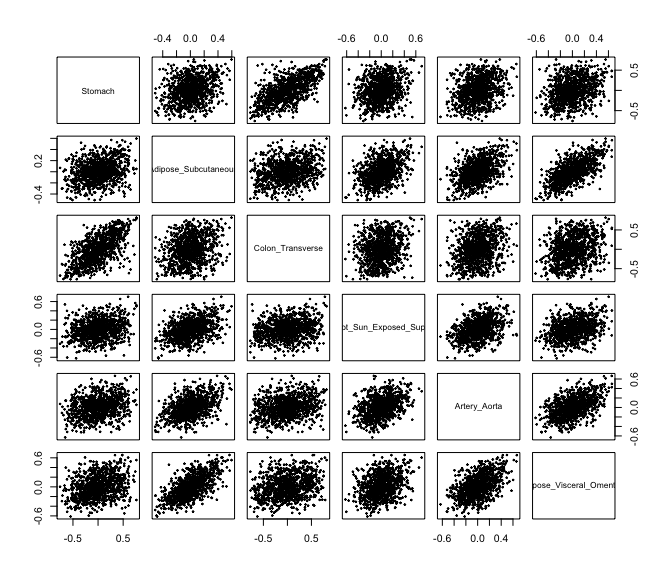

# Data Fusion under Distributional Uncertainty

## How to install

1.  The [devtools](https://github.com/hadley/devtools) package has to be
    installed. You can install it using `install.packages("devtools")`.
2.  The latest development version can then be installied using
    `devtools::install_github("yujinj/dlm")`.

``` r
#devtools::install_github("yujinj/dlm")
library(dlm)
```

## Usage: Applications on GTEx Data

In this example, we use the [GTEx
V6](https://www.gtexportal.org/home/downloads/adult-gtex/qtl) gene
expression data. The data has already been preprocessed and normalized.
We simply filter out genes to only include those observed in all
tissues.

First, one has to choose $L$ different test functions. Then, define a
single test function that takes a data set and applies your choice of
$L$ test functions. If the sample size of the data set is $n$, the
output should be $n \times L$. In this GTEx example, we choose
$L = 1000$ test functions as the products of gene-expressions for
randomly selected $L$ gene-pairs.

``` r
set.seed(1)
L = 1000
names1 <- sample(intersect_names, size=L, replace=FALSE)
names2 <- sample(intersect_names, size=L, replace=FALSE)
test.function <- function(data){return(data[,names1] * data[,names2])}
phi <- function(data){return(data[,names1] * data[,names2])}
```

We obtain the correlation matrix of 1000 test functions and check that
they are mostly weakly correlated. For example, 90% of the correlations
are within the range: \[-0.05876375, 0.05958139\].

``` r
phi_matrix = lapply(GTEx_data, FUN=phi)
phi_matrix = do.call(rbind, phi_matrix)
cor_phi = cor(phi_matrix)
quantile(cor_phi[row(cor_phi)!=col(cor_phi)], c(0.05, 0.95))
```

    ##          5%         95% 
    ## -0.05876375  0.05958139

Then, we fit distributional regressions.

**Example 1**: The target tissue is Adipose Subcutaneous. Other
available tissues are Stomach, Colon Transverse, Skin (not sun exposed),
Artery Aorta, and Adipose Visceral Omentum.

``` r
dlm.fit = dlm(Adipose_Subcutaneous ~ Stomach + 
                                     Colon_Transverse + 
                                     Skin_Not_Sun_Exposed_Suprapubic + 
                                     Artery_Aorta + 
                                     Adipose_Visceral_Omentum, 
              test.function = phi, 
              data = GTEx_data, 
              whitening = FALSE)
```

``` r
dlm.fit
```

    ## 
    ## Call:
    ## dlm(formula = Adipose_Subcutaneous ~ Stomach + Colon_Transverse + 
    ##     Skin_Not_Sun_Exposed_Suprapubic + Artery_Aorta + Adipose_Visceral_Omentum, 
    ##     test.function = phi, data = GTEx_data, whitening = FALSE)
    ## 
    ## Residuals:
    ##      Min       1Q   Median       3Q      Max 
    ## -0.51330 -0.09280 -0.00250  0.09719  0.55574 
    ## 
    ## Coefficients:
    ##                                 Estimate Std. Error t value Pr(>|t|)    
    ## Stomach                          0.04250    0.02080   2.043   0.0413 *  
    ## Colon_Transverse                 0.04331    0.01775   2.439   0.0149 *  
    ## Skin_Not_Sun_Exposed_Suprapubic  0.25449    0.02303  11.050  < 2e-16 ***
    ## Artery_Aorta                     0.18669    0.02566   7.274 7.05e-13 ***
    ## Adipose_Visceral_Omentum         0.47301    0.02315  20.431  < 2e-16 ***
    ## ---
    ## Signif. codes:  0 '***' 0.001 '**' 0.01 '*' 0.05 '.' 0.1 ' ' 1
    ## 
    ## Residual standard error: 0.1463 on 996 degrees of freedom
    ## Multiple R-squared:  0.2859, Adjusted R-squared:  0.2831 
    ## F-statistic:  99.7 on 4 and 996 DF,  p-value: < 2.2e-16

We present a pair plot where each row and column represents one tissue,
and each dot represents the mean of the test function. In our case, the
mean of the test function corresponds to the covariance of a randomly
selected gene-pair. We can observe some linear relationships between
tissues, which are reflected in our ‘dlm’ results.

<!-- -->

**Example 2**: The target tissue is Stomach. Other available tissues are
Adipose Subcutaneous, Colon Transverse, Skin (not sun exposed), Artery
Aorta, and Adipose Visceral Omentum.

``` r
dlm.fit = dlm(Stomach ~ Adipose_Subcutaneous + 
                        Colon_Transverse + 
                        Skin_Not_Sun_Exposed_Suprapubic + 
                        Artery_Aorta + 
                        Adipose_Visceral_Omentum, 
              test.function = phi, 
              data = GTEx_data, 
              whitening = FALSE)
```

``` r
dlm.fit
```

    ## 
    ## Call:
    ## dlm(formula = Stomach ~ Adipose_Subcutaneous + Colon_Transverse + 
    ##     Skin_Not_Sun_Exposed_Suprapubic + Artery_Aorta + Adipose_Visceral_Omentum, 
    ##     test.function = phi, data = GTEx_data, whitening = FALSE)
    ## 
    ## Residuals:
    ##      Min       1Q   Median       3Q      Max 
    ## -0.72809 -0.13488  0.00535  0.14058  0.97711 
    ## 
    ## Coefficients:
    ##                                 Estimate Std. Error t value Pr(>|t|)    
    ## Adipose_Subcutaneous             0.09820    0.04806   2.043 0.041312 *  
    ## Colon_Transverse                 0.51287    0.02165  23.692  < 2e-16 ***
    ## Skin_Not_Sun_Exposed_Suprapubic  0.13925    0.03683   3.781 0.000165 ***
    ## Artery_Aorta                     0.11325    0.03987   2.840 0.004597 ** 
    ## Adipose_Visceral_Omentum         0.13644    0.04170   3.272 0.001105 ** 
    ## ---
    ## Signif. codes:  0 '***' 0.001 '**' 0.01 '*' 0.05 '.' 0.1 ' ' 1
    ## 
    ## Residual standard error: 0.2224 on 996 degrees of freedom
    ## Multiple R-squared:  0.1735, Adjusted R-squared:  0.1702 
    ## F-statistic: 52.26 on 4 and 996 DF,  p-value: < 2.2e-16

We present a pair plot where each row and column represents one tissue,
and each dot represents the mean of the test function. In our case, the
mean of the test function corresponds to the covariance of a randomly
selected gene-pair. We can observe some linear relationships between
tissues, which are reflected in our ‘dlm’ results.

<!-- -->
