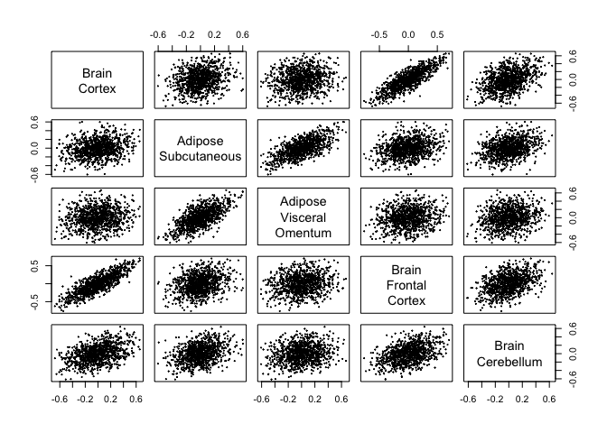

# Distribution Generalization under Dense Distributional Shifts

## How to install

1.  The [devtools](https://github.com/hadley/devtools) package has to be
    installed. You can install it using `install.packages("devtools")`.
2.  The latest development version can then be installied using
    `devtools::install_github("yujinj/dlm")`.

``` r
#devtools::install_github("yujinj/dlm", force=TRUE)
library(dlm)
```

## Usage: Applications on GTEx Data

In this example, we use the [GTEx
V6](https://www.gtexportal.org/home/downloads/adult-gtex/qtl) gene
expression data. The data has already been preprocessed and normalized.
We simply filter out genes to only include those observed in all tissues
and then randomly sample 5000 genes to reduce the size of the data set.
The preprocessed data set is provided in the package as ‘GTEx_data’.

First, one has to choose $L$ different test functions. Then, define a
single test function that takes a data set and applies your choice of
$L$ test functions. If the sample size of the data set is $n$, the
output should be $n \times L$. In this GTEx example, we choose
$L = 1000$ test functions as the products of gene-expressions for
randomly selected $L$ gene-pairs.

``` r
set.seed(1000)
L = 1000
names = colnames(GTEx_data[[1]])
names1 <- sample(names, size=L, replace=FALSE)
names2 <- sample(names, size=L, replace=FALSE)
test.function <- function(data){return(data[,names1] * data[,names2])}
phi <- function(data){return(data[,names1] * data[,names2])}
```

We obtain the correlation matrix of 1000 test functions and check that
they are mostly weakly correlated. For example, 90% of the correlations
are within the range: \[-0.059, 0.059\].

``` r
phi_matrix = lapply(GTEx_data, FUN=phi)
phi_matrix = do.call(rbind, phi_matrix)
cor_phi = cor(phi_matrix)
quantile(cor_phi[row(cor_phi)!=col(cor_phi)], c(0.05, 0.95))
```

    ##          5%         95% 
    ## -0.05839611  0.05864404

### Example in the Paper

The target tissue is Brain_Cortex. Other available tissues are
Adipose_Subcutaneous, Adipose_Visceral_Omentum,
Brain_Frontal_Cortex_BA9, and Brain_Cerebellum.

``` r
dlm.fit = dlm(Brain_Cortex ~ Adipose_Subcutaneous + 
                             Adipose_Visceral_Omentum +
                             Brain_Frontal_Cortex_BA9 +
                             Brain_Cerebellum,
              test.function = phi, 
              data = GTEx_data, 
              whitening = FALSE)
```

``` r
dlm.fit
```

    ## 
    ## Call:
    ## dlm(formula = Brain_Cortex ~ Adipose_Subcutaneous + Adipose_Visceral_Omentum + 
    ##     Brain_Frontal_Cortex_BA9 + Brain_Cerebellum, test.function = phi, 
    ##     data = GTEx_data, whitening = FALSE)
    ## 
    ## Residuals:
    ##      Min       1Q   Median       3Q      Max 
    ## -0.56838 -0.09436 -0.00604  0.08739  0.40917 
    ## 
    ## Coefficients:
    ##                            Estimate Std. Error t value Pr(>|t|)    
    ## Adipose_Subcutaneous     -0.0001295  0.0304036  -0.004   0.9966    
    ## Adipose_Visceral_Omentum  0.0462641  0.0250888   1.844   0.0655 .  
    ## Brain_Frontal_Cortex_BA9  0.7846112  0.0184325  42.567  < 2e-16 ***
    ## Brain_Cerebellum          0.1692543  0.0217128   7.795 1.61e-14 ***
    ## ---
    ## Signif. codes:  0 '***' 0.001 '**' 0.01 '*' 0.05 '.' 0.1 ' ' 1
    ## 
    ## Residual standard error: 0.1377 on 997 degrees of freedom
    ## Multiple R-squared:  0.5088, Adjusted R-squared:  0.5073 
    ## F-statistic: 344.3 on 3 and 997 DF,  p-value: < 2.2e-16

We present a pair plot where each row and column represents one tissue,
and each dot represents the mean of the test function. In our case, the
mean of the test function corresponds to the covariance of a randomly
selected gene-pair. We can observe some linear relationships between
tissues, which are reflected in our ‘dlm’ results.

``` r
pairs(dlm.fit$X, cex = 0.2, labels = c("Brain\nCortex", "Adipose\nSubcutaneous", "Adipose\nVisceral\nOmentum", "Brain\nFrontal\nCortex", "Brain\nCerebellum"))
```

<!-- -->

To evaluate the appropriateness of the fitted distribution shift model,
we plot a distributional residual plot and distributional QQ plot.

``` r
par(mfrow = c(2, 1))
plot(dlm.fit$lm.fit, which = c(1, 2))
```

<!-- -->

### More Examples

We randomly select 6 tissues: Artery_Aorta, Vagina,
Esophagus_Gastroesophageal_Junction, Esophagus_Muscularis,
Muscle_Skeletal, Skin_Not_Sun_Exposed_Suprapubic.

``` r
set.seed(1000)
sampled_tissues = sample(names(GTEx_data), 6)
sampled_tissues
```

    ## [1] "Artery_Aorta"                        "Vagina"                             
    ## [3] "Esophagus_Gastroesophageal_Junction" "Esophagus_Muscularis"               
    ## [5] "Muscle_Skeletal"                     "Skin_Not_Sun_Exposed_Suprapubic"

Let the target tissue be Artery_Aorta.

``` r
dlm.fit = dlm(Artery_Aorta ~ Vagina + 
                             Esophagus_Gastroesophageal_Junction + 
                             Esophagus_Muscularis + 
                             Muscle_Skeletal +
                             Skin_Not_Sun_Exposed_Suprapubic,
              test.function = phi, 
              data = GTEx_data, 
              whitening = FALSE)
```

``` r
dlm.fit
```

    ## 
    ## Call:
    ## dlm(formula = Artery_Aorta ~ Vagina + Esophagus_Gastroesophageal_Junction + 
    ##     Esophagus_Muscularis + Muscle_Skeletal + Skin_Not_Sun_Exposed_Suprapubic, 
    ##     test.function = phi, data = GTEx_data, whitening = FALSE)
    ## 
    ## Residuals:
    ##      Min       1Q   Median       3Q      Max 
    ## -0.63242 -0.10869  0.00123  0.10808  0.56197 
    ## 
    ## Coefficients:
    ##                                     Estimate Std. Error t value Pr(>|t|)    
    ## Vagina                               0.12676    0.02079   6.097 1.55e-09 ***
    ## Esophagus_Gastroesophageal_Junction  0.22002    0.04970   4.427 1.06e-05 ***
    ## Esophagus_Muscularis                 0.23439    0.04864   4.819 1.67e-06 ***
    ## Muscle_Skeletal                      0.14467    0.02752   5.256 1.80e-07 ***
    ## Skin_Not_Sun_Exposed_Suprapubic      0.27415    0.02751   9.964  < 2e-16 ***
    ## ---
    ## Signif. codes:  0 '***' 0.001 '**' 0.01 '*' 0.05 '.' 0.1 ' ' 1
    ## 
    ## Residual standard error: 0.1706 on 996 degrees of freedom
    ## Multiple R-squared:  0.01825,    Adjusted R-squared:  0.01431 
    ## F-statistic: 4.628 on 4 and 996 DF,  p-value: 0.001049

``` r
pairs(dlm.fit$X, cex = 0.2, labels = gsub("_", "\n", sampled_tissues))
```

<!-- -->

Let the target tissue be Esophagus_Muscularis.

``` r
dlm.fit = dlm(Esophagus_Muscularis ~ Artery_Aorta +
                                     Vagina + 
                                     Esophagus_Gastroesophageal_Junction + 
                                     Muscle_Skeletal +
                                     Skin_Not_Sun_Exposed_Suprapubic,
              test.function = phi, 
              data = GTEx_data, 
              whitening = FALSE)
```

``` r
dlm.fit
```

    ## 
    ## Call:
    ## dlm(formula = Esophagus_Muscularis ~ Artery_Aorta + Vagina + 
    ##     Esophagus_Gastroesophageal_Junction + Muscle_Skeletal + Skin_Not_Sun_Exposed_Suprapubic, 
    ##     test.function = phi, data = GTEx_data, whitening = FALSE)
    ## 
    ## Residuals:
    ##      Min       1Q   Median       3Q      Max 
    ## -0.33478 -0.07010  0.00437  0.08240  0.33172 
    ## 
    ## Coefficients:
    ##                                     Estimate Std. Error t value Pr(>|t|)    
    ## Artery_Aorta                         0.09720    0.02017   4.819 1.67e-06 ***
    ## Vagina                               0.02822    0.01361   2.074   0.0384 *  
    ## Esophagus_Gastroesophageal_Junction  0.79829    0.02012  39.678  < 2e-16 ***
    ## Muscle_Skeletal                      0.11432    0.01760   6.496 1.30e-10 ***
    ## Skin_Not_Sun_Exposed_Suprapubic     -0.03803    0.01854  -2.051   0.0405 *  
    ## ---
    ## Signif. codes:  0 '***' 0.001 '**' 0.01 '*' 0.05 '.' 0.1 ' ' 1
    ## 
    ## Residual standard error: 0.1098 on 996 degrees of freedom
    ## Multiple R-squared:  0.5165, Adjusted R-squared:  0.5146 
    ## F-statistic:   266 on 4 and 996 DF,  p-value: < 2.2e-16
